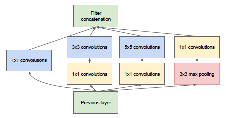

# GoogLeNet

## Intro

This directory is the implementation of GoogLeNet, the convolutional neural network structure demonstrated in the
paper [Going deeper with convolutions](https://arxiv.org/pdf/1409.4842.pdf) by Szegedy et al. published on CVPR 2015. In
this paper, the author purposed a method that makes input flow through four different channels and concatenates them
together. In this directory, we used TensorFlow and Keras framework to implement a simple GoogLeNet model and trained
our fine-tuned model with Cifar 10 model, receiving a top-1 accuracy of 90% on test set using data augmentation and weight decay.

### Structure of Directory

- [GoogLeNet.py](GoogLeNet.py)
  This python file contains a function that builds a raw GoogleNet model that can be trained on ImageNet dataset.
- [GoogLeNet.png](GoogLeNet.png)
  This png file shows the structure of GoogLeNet that can be trained on ImageNet dataset.
- [GoogLeNet.ipynb](GoogLeNet.ipynb)
  This Jupyter Notebook records our training of GoogLeNet on Cifar 10 dataset. It can be run on any devices.
- [Weights](weights)
  This directory contains the weights that we trained on Cifar 10 dataset.