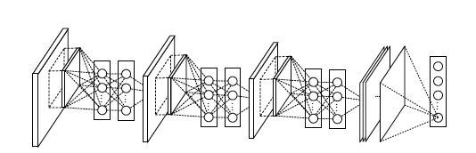

# Network in Network

## Intro

This directory is the implementation of NiN, the convolutional neural network structure demonstrated in the
paper [Network In Network](https://arxiv.org/pdf/1312.4400.pdf) by Lin et al. published in 2013. In this paper, the author purposed a network that only uses convolutional layers to make image classification. In this directory, we used TensorFlow and Keras framework to implement a simple NiN model and trained our fine-tuned model with Cifar 10 model, receiving a top-1 accuracy of 90% on test set using data augmentation and weight decay.

### Structure of Directory

- [NiN.py](NiN.py)
  This python file contains a function that builds a raw NiN model that can be trained on ImageNet dataset.
- [NiN.ipynb](NiN.ipynb)
  This Jupyter Notebook records our training of NiN on Cifar 10 dataset. It can be run on any devices.