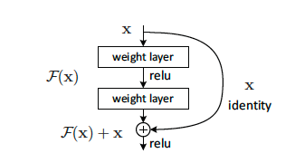

# ResNet

## Intro

This directory is the implementation of ResNet, the convolutional neural network structure demonstrated in the
paper [Deep Residual Learning for Image Recognition](https://arxiv.org/pdf/1512.03385.pdf) by He et al. published on
CVPR 2016. In this paper, the author purposed a residual learning method that prevents gradient vanishing as well as
overfitting. In this directory, we used TensorFlow and Keras framework to implement a simple ResNet model and trained
our fine-tuned model with Cifar 10 model, receiving a top-1 accuracy of 89%.

### Structure of Directory

- [ResNet.py](ResNet.py)
  This python file contains a function that builds a raw ResNet model that can be trained on ImageNet dataset.
- [ResNet.png](ResNet-152.png)
  This png file shows the structure of ResNet-152 that can be trained on ImageNet dataset.
- [ResNet.ipynb](ResNet.ipynb)
  This Jupyter Notebook records our training of ResNet on Cifar 10 dataset. It can be run on any devices
- [Weights](weights)
  This directory contains the weights that we trained on Cifar 10 dataset.

  **Update:** the weight file is too large to upload to GitHub and will be fixed soon.