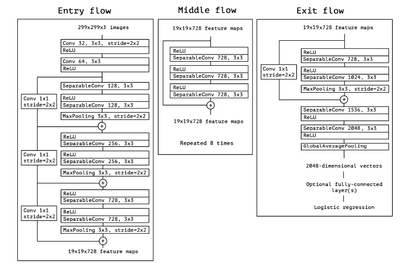

# Xception

## Intro

This directory is the implementation of Xception, the convolutional neural network structure demonstrated in the
paper [Xception: Deep Learning with Depthwise Separable Convolutions](https://arxiv.org/pdf/1610.02357.pdf) by Chollet,
published on CVPR 2017. In this paper, the authors demonstrates a model consisting of entry flow, middle flow, and exit
flow, each with several separable convolutional layers and pooling layers. The detailed description of the model can be
found in the paper listed above. In this directory, we used TensorFlow and Keras framework to implement a simple
Xception model.

### Structure of Directory

- [Xception.py](Xception.py)
  This python file contains a function that builds a raw Xception model that can be trained on ImageNet dataset.
- [Xception.png](Xception.png)
  This png file shows the structure of Xception that can be trained on ImageNet dataset.
